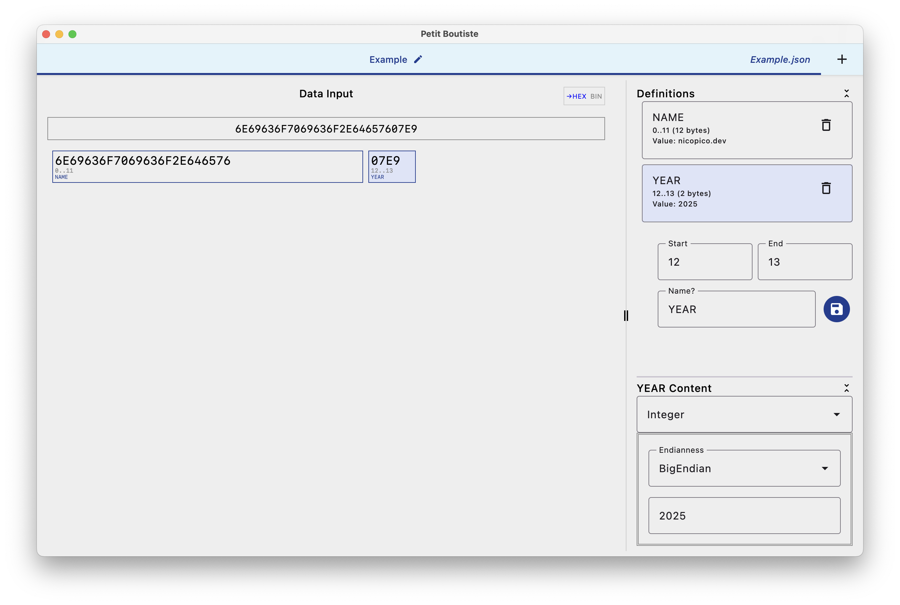

# Petit Boutiste

Petit Boutiste is a desktop application for analyzing and interpreting hexadecimal data. It provides a user-friendly interface for working with binary data formats, allowing you to define and visualize byte groups with different representations.



## Features

- Input and display hexadecimal data
- Define named groups of bytes
- Interpret byte groups as different data types:
  - Raw hexadecimal
  - Integer values (with configurable endianness)
  - Text (with configurable character set and endianness)
- Save and load templates for reuse with similar data structures
- Export and import templates for sharing

## Getting Started

### Prerequisites

- JDK 11 or later

### Running the Application

You can run the application using Gradle:

```bash
./gradlew :composeApp:desktopRun
```

For faster development with hot reload:

```bash
./gradlew :composeApp:desktopRunHot
```

### Building a distributable application

You can build distributable application for the OS running the build:

```bash
./gradlew :composeApp:createReleaseDistributable
```

This will create packages in the following formats depending on your OS:
- macOS: APP
- Windows: EXE
- Linux: ?

## Project Structure

### Key Components

#### Models

- `HexString`: Represents a normalized hexadecimal string
- `ByteItem`: Sealed class representing either a single byte or a group of bytes
  - `ByteItem.Single`: Represents a single byte (two hex characters)
  - `ByteItem.Group`: Represents a named group of bytes
- `ByteGroupDefinition`: Defines a group of bytes with a name and representation format
- `RepresentationFormat`: Defines how a byte group should be interpreted
  - `Hexadecimal`: Raw hex representation
  - `Integer`: Numeric interpretation with configurable endianness
  - `Text`: Text interpretation with configurable charset and endianness

#### UI Components

- `AppScreen`: Main application screen with multi-pane layout
- `HexInput`: Component for inputting hexadecimal data
- `HexDisplay`: Component for displaying hexadecimal data with byte groups
- `ByteGroupDefinitions`: Component for managing byte group definitions
- `TemplateManagement`: Component for saving, loading, and sharing templates

### Code Organization

- `fr.nicopico.petitboutiste`
  - `models`: Data models and business logic
  - `ui`: User interface components
    - `components`: Reusable UI components
    - `infra`: Infrastructure code for UI (previews, state savers)

## Development

### Technology Stack

- Kotlin Multiplatform
- Compose Multiplatform for UI
- Kotlinx Serialization for JSON serialization
- Multiplatform Settings for preferences

### Building from Source

1. Clone the repository
2. Open the project in IntelliJ IDEA or Android Studio
3. Build and run using the Gradle tasks mentioned above
